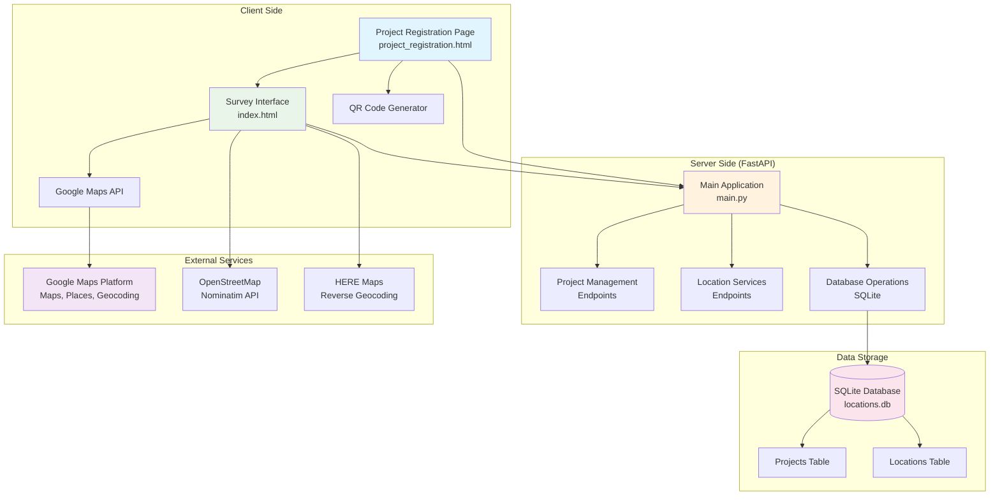
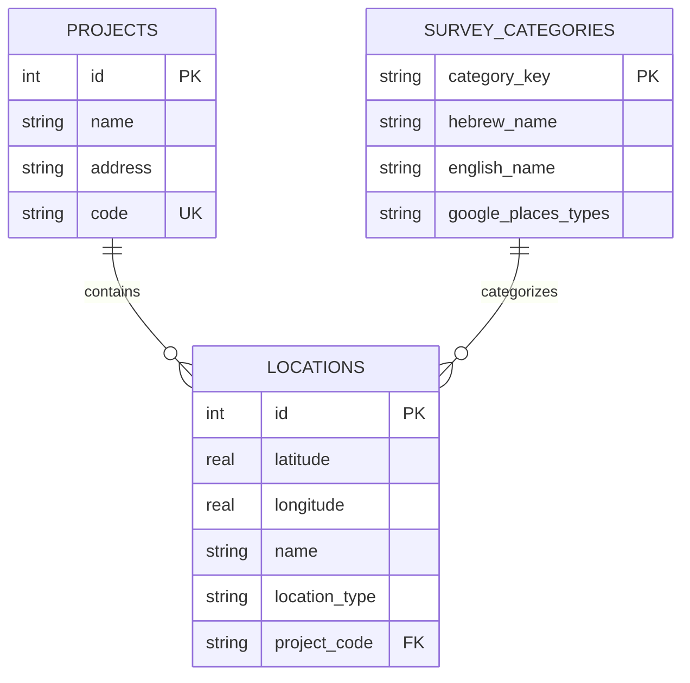
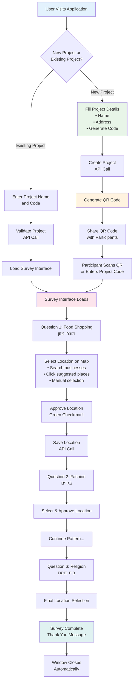
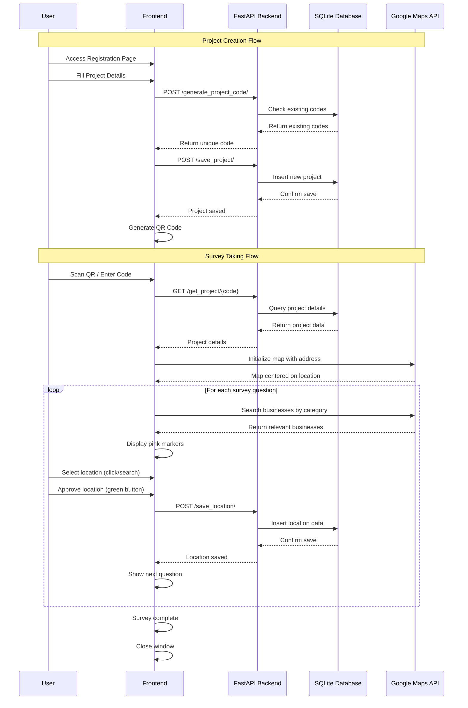
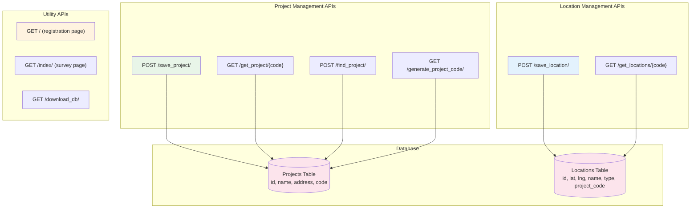
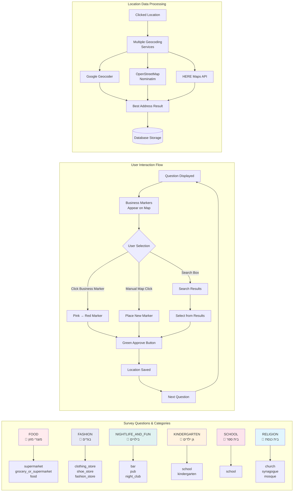

# 🗺️ GeospatialMapping - Interactive Location Survey System

An interactive web-based application for collecting and managing geospatial data through user surveys. The system allows users to create projects, collect location data through guided questionnaires, and visualize results on Google Maps.


## 🌟 Features

### 📋 Project Management
- **Create Projects**: Set up new survey projects with custom names, addresses, and unique codes
- **Project Registration**: Simple interface for creating and managing projects
- **QR Code Generation**: Automatic QR code generation for easy survey sharing
- **Project Validation**: Find and validate existing projects by name or code

### 🗺️ Interactive Mapping
- **Google Maps Integration**: Full-featured map interface with search capabilities
- **Multi-language Support**: Hebrew interface with RTL support
- **Smart Location Detection**: Automatic address resolution using multiple geocoding services
- **Business Discovery**: Intelligent business suggestions based on survey questions

### 📊 Data Collection
- **Structured Surveys**: Pre-defined questions covering various location types:
  - 🛒 **Food Shopping**: Grocery stores and supermarkets
  - 👔 **Fashion**: Clothing and shoe stores
  - 🎉 **Nightlife & Entertainment**: Bars, pubs, and clubs
  - 🎒 **Education**: Kindergartens and schools
  - 🕍 **Religious Services**: Synagogues and religious centers

### 💾 Data Management
- **SQLite Database**: Lightweight, file-based database storage
- **Real-time Data Saving**: Instant location data persistence
- **Data Export**: Database download functionality for analysis
- **Location History**: Complete tracking of all submitted locations

## 🏗️ Architecture

### System Overview



### Backend (FastAPI)
```
main.py                 # Main application with API endpoints
├── Project Management  # Create, find, and validate projects
├── Location Services   # Save and retrieve location data
├── Database Management # SQLite operations and data handling
└── File Serving       # Static file serving and downloads
```

### Frontend (HTML/JavaScript)
```
project_registration.html  # Project creation and management interface
index.html                 # Main survey interface with map
├── Google Maps API        # Interactive mapping functionality
├── Places API            # Business search and location services
├── SweetAlert2           # User-friendly notifications
└── QR Code Generation    # Survey sharing capabilities
```

### Database Schema



```sql
-- Projects table
CREATE TABLE projects (
    id INTEGER PRIMARY KEY AUTOINCREMENT,
    name TEXT NOT NULL,
    address TEXT NOT NULL,
    code TEXT NOT NULL
);

-- Locations table
CREATE TABLE locations (
    id INTEGER PRIMARY KEY AUTOINCREMENT,
    latitude REAL NOT NULL,
    longitude REAL NOT NULL,
    name TEXT NOT NULL,
    location_type TEXT NOT NULL,
    project_code TEXT NOT NULL
);
```

## 🚀 Quick Start

### Prerequisites
- Python 3.8+
- Google Maps API Key
- Modern web browser

### Installation

1. **Clone the repository**
```bash
git clone https://github.com/yourusername/GeospatialMapping.git
cd GeospatialMapping
```

2. **Install dependencies**
```bash
pip install -r requirements.txt
```

3. **Configure Google Maps API**
   - Get a Google Maps API key from [Google Cloud Console](https://console.cloud.google.com/)
   - Enable the following APIs:
     - Maps JavaScript API
     - Places API
     - Geocoding API
   - Update the API key in `GoogleMapAPIKEY.txt`
   - Update the API key in HTML files (`index.html` and `project_registration.html`)

4. **Run the application**
```bash
python main.py
```

5. **Access the application**
   - Open your browser and navigate to `http://localhost:8000`
   - Start creating projects and collecting location data!

## 📖 Usage Guide

### User Flow Overview



### Creating a New Project

1. **Access the Registration Page**
   - Navigate to the application homepage
   - Click "צור פרויקט" (Create Project)

2. **Fill Project Details**
   - Enter project name in Hebrew
   - Provide the project address
   - Generate a unique project code
   - Click "המשך" (Continue)

3. **Share Your Survey**
   - Use the generated QR code for easy sharing
   - Share the project code with participants
   - Monitor results in real-time

### Taking a Survey

1. **Start the Survey**
   - Scan the QR code or enter the project code
   - The map will center on the project location

2. **Answer Questions**
   - Each question focuses on a specific location type
   - Search for businesses using the search box
   - Click on suggested businesses or manually select locations
   - Approve your selection with the green checkmark

3. **Complete the Survey**
   - Answer all questions in sequence
   - Locations are automatically saved
   - Receive confirmation messages

### Managing Data

1. **View Results**
   - Use the "הצג תוצאות" (Show Results) button
   - Access collected location data
   - Download the database for analysis

2. **Continue Existing Projects**
   - Enter project name and code
   - Continue data collection
   - Access previous responses

## 🛠️ API Endpoints

### Technical Flow Diagram



### API Endpoints Overview



### Project Management
- `POST /save_project/` - Create a new project
- `GET /get_project/{project_code}` - Retrieve project details
- `POST /find_project/` - Find project by name or code
- `GET /generate_project_code/` - Generate unique project code

### Location Services
- `POST /save_location/` - Save location data
- `GET /get_locations/{project_code}` - Retrieve all project locations

### Utility Endpoints
- `GET /download_db/` - Download SQLite database
- `GET /` - Serve project registration page
- `GET /index/` - Serve survey interface

## 🎨 Technology Stack

### Backend
- **FastAPI**: Modern, fast web framework for building APIs
- **SQLite**: Lightweight database for data persistence
- **Uvicorn**: ASGI server for running the application
- **Pydantic**: Data validation and settings management

### Frontend
- **Vanilla JavaScript**: Core functionality and API interactions
- **Google Maps API**: Interactive mapping and location services
- **SweetAlert2**: Beautiful, responsive popup notifications
- **QRCode.js**: Client-side QR code generation
- **Font Awesome**: Professional icons and UI elements

### External Services
- **Google Maps Platform**: Maps, Places, and Geocoding APIs
- **OpenStreetMap Nominatim**: Fallback geocoding service
- **HERE Maps**: Additional geocoding capabilities

## 🗺️ Supported Location Categories

### Survey Process & Category Mapping



### Category Details

The system supports the following predefined categories:

| Category | Hebrew | Google Places Types |
|----------|--------|-------------------|
| FOOD | מוצרי מזון | supermarket, grocery_or_supermarket, food |
| FASHION | בגדים | clothing_store, shoe_store, fashion_store |
| NIGHTLIFE_AND_FUN | בילויים | bar, pub, night_club |
| KINDERGARTEN | גן ילדים | school, kindergarten |
| SCHOOL | בית ספר | school |
| RELIGION | בית כנסת | church, synagogue, mosque |

## 🔮 Future Enhancements

Based on the project's TODO list:

- [ ] **Enhanced Business Discovery**: Automatically display relevant businesses for each question
- [ ] **UI/UX Improvements**: Remove static approve button, implement location-attached notifications
- [ ] **Browser Compatibility**: Fix window closing issues across different browsers
- [ ] **Custom Markers**: Different marker styles for different business types
- [ ] **Advanced Analytics**: Data visualization and reporting features
- [ ] **Multi-language Support**: Additional language interfaces
- [ ] **Offline Capabilities**: Local data storage and sync functionality

## 🤝 Contributing

We welcome contributions! Please follow these guidelines:

1. Fork the repository
2. Create a feature branch (`git checkout -b feature/AmazingFeature`)
3. Commit your changes (`git commit -m 'Add some AmazingFeature'`)
4. Push to the branch (`git push origin feature/AmazingFeature`)
5. Open a Pull Request

## 📝 License

This project is licensed under the MIT License - see the [LICENSE](LICENSE) file for details.

## 📞 Support

For support, questions, or feature requests:

- 📧 Email: [your-email@domain.com]
- 🐛 Issues: [GitHub Issues](https://github.com/yourusername/GeospatialMapping/issues)
- 💬 Discussions: [GitHub Discussions](https://github.com/yourusername/GeospatialMapping/discussions)

## 🙏 Acknowledgments

- Google Maps Platform for providing excellent mapping services
- FastAPI community for the amazing framework
- OpenStreetMap contributors for geocoding services
- The open-source community for inspiration and tools

---

**Made with ❤️ for better geospatial data collection** 